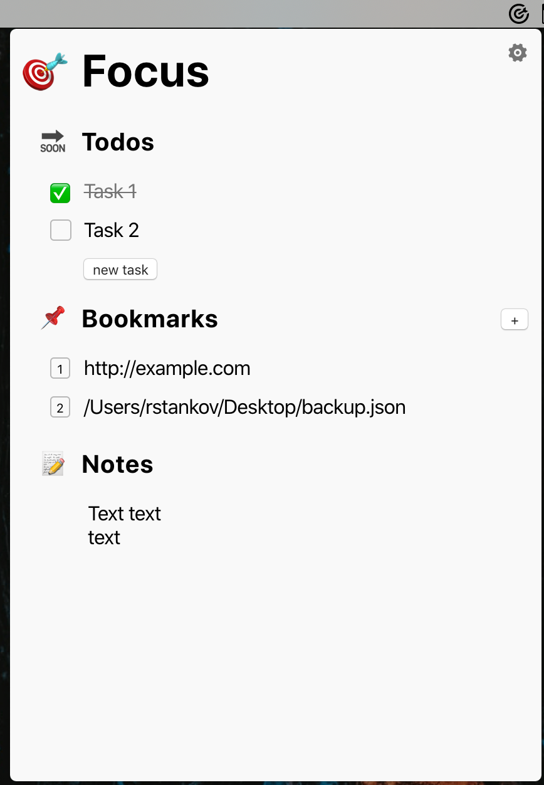

#  Focused Task

A macOS menu bar task app build with React/Redux and Electron.

It lets you focus on one task at the time and split it into minor todos and keep all related information about this task in one place.

> This is just an experiment, don't take it too seriously 😅
>
> *Rado Stankov*


### Screenshot




### Features

* Only one task - *this is a feature, not a bug* 🎯
* Shortcut for everything - *you don't need mouse* 🛑 🖱
* Menu-bar app - *it gets out of your way* 😇
* Organize your one task into - todos, bookmark links, and free-form text 📋
* Drag & Drop file as bookmarks 🔖
* Open-sourced 💻

### Installation

Have `yarn` installed

```
./bin/bootstrap
```

### Running

```
yarn dev
```

### Pre-release

Beta is available <a href="https://focused-tasks.s3.eu-central-1.amazonaws.com/FocusedTask-0.1.0.dmg">here</a>. It still not signed for MacOS and auto-update doesn't work.
